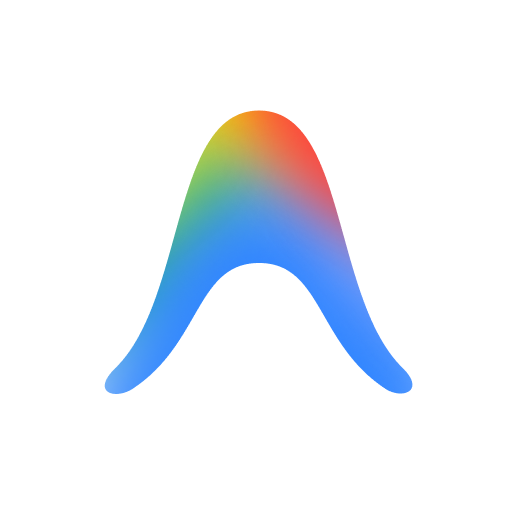

# Antigravity Mac 代理启动器

<p align="center">
  
</p>

<p align="center">
  <b>🚀 一键以免 TUN 代理模式启动 Antigravity，自动检测代理软件与端口</b>
</p>

<p align="center">
  
  
  
  
</p>

<p align="center">
  <a href="README_EN.md">🇬🇧 English</a>
</p>

---

## 📖 为什么需要这个工具？

Antigravity 的核心后端（`language_server`，Go 语言编写）在从 Dock 或 Launchpad 双击启动时，**不会继承终端的代理环境变量**，因此在国内网络环境下往往必须开启 Clash 的 **TUN 模式**（全局虚拟网卡）。

TUN 模式的缺点：
- 🔴 需要 root 权限
- 🔴 会影响所有应用的流量（影响本地开发环境）
- 🔴 有时与某些工具冲突（Docker、VPN 等）

**本工具的解决方案**：用 macOS 原生环境变量注入方式启动 Antigravity，让它主动识别代理，**完全不需要 TUN 模式**。

---

## ✨ 功能特性

| 功能 | 说明 |
|------|------|
| 🔍 自动检测代理 | 自动读取 macOS 系统代理配置，识别运行中的代理软件 |
| 🔄 兜底端口扫描 | 系统代理未配置时自动扫描常用端口 |
| ✍️ 手动输入端口 | 检测失败时支持手动输入 |
| 🖱️ 一键启动 | 双击即可确认代理配置并启动 Antigravity |
| ❌ 一键关闭 | 可选仅关闭 Antigravity 或同时关闭代理软件 |
| 🔁 智能切换 | 检测 Antigravity 是否已在运行，自动切换到关闭模式 |

**支持的代理软件：**

| 代理软件 | 自动识别 | 系统代理优先 | 端口扫描兜底 |
|---------|---------|-------------|------------|
| Clash Verge / Mihomo | ✅ | ✅ | ✅ |
| ClashX / ClashX Pro | ✅ | ✅ | ✅ |
| V2rayN / V2rayU | ✅ | ✅ | ✅ |
| Surge | ✅ | ✅ | ✅ |
| Proxyman | ✅ | ✅ | ✅ |
| ShadowsocksX-NG | ✅ | ✅ | ✅ |
| sing-box / NekoBox | ✅ | ✅ | ✅ |
| 其他任意代理 | — | ✅（只要开了系统代理）| ✅ |

---

## ⚡ 快速安装

### 方法一：一键脚本（推荐）

```bash
git clone https://github.com/lz-code-2844/antigravity-mac-proxy-launcher.git
cd antigravity-mac-proxy-launcher
bash install.sh
```

安装完成后，桌面上会出现「**Antigravity 代理启动器**」图标。

### 方法二：手动编译

```bash
osacompile -o ~/Applications/Antigravity\ 代理启动器.app src/launcher.applescript
# 可选：替换图标
cp /Applications/Antigravity.app/Contents/Resources/icon.icns \
   ~/Applications/Antigravity\ 代理启动器.app/Contents/Resources/applet.icns
```

---

## 🖱️ 使用方法

### 启动流程

1. **先启动你的代理软件**（Clash Verge、V2rayN 等）
2. **双击桌面的「Antigravity 代理启动器」**

   启动器会自动检测代理端口并弹出确认对话框：
   ```
   ✅ 检测到代理配置：

   代理软件：Clash Verge
   SOCKS5 端口：127.0.0.1:7897
   HTTP 端口：127.0.0.1:7897

   启动后 Antigravity 的所有流量将强制走代理，
   无需开启 TUN 模式。
   ```

3. 点击「**启动 Antigravity**」即可

### 关闭流程

再次**双击启动器图标**，会显示当前代理信息并提供关闭选项：

- **关闭 Antigravity**：直接退出 Antigravity，其专属代理环境变量随进程销毁而自动失效；Clash / V2Ray 等系统级代理软件不受任何影响，继续正常运行。
- **防止多开卡死**：如果 Antigravity 已经在运行中，双击不会重复开新实例，会自动将当前运行的窗口唤起到前台，避免多实例冲突卡死。

### 代理检测失败时

如果检测不到代理端口，会提示手动输入端口号（适用于任意代理软件的自定义端口）。

---

## 🔧 代理检测原理

启动器按以下优先级自动检测代理：

```
1. scutil --proxy (macOS 系统代理配置)
        ↓ 未检测到
2. 识别运行中的代理软件进程名
        ↓ 未检测到
3. 扫描常用端口（7897/7890/7891/1080/10808 等）
        ↓ 仍未检测到
4. 提示手动输入端口
```

> **提示**：建议在代理软件中开启「系统代理（System Proxy）」功能（不是 TUN），这样检测最准确、最稳定。

---

## 🔍 代理效果验证

启动后，在终端运行：

```bash
# 查看 language_server 进程的代理环境变量
ps eww $(pgrep -x language_server) | tr ' ' '\n' | grep -i proxy
```

正常输出应类似：
```
HTTP_PROXY=http://127.0.0.1:7897
HTTPS_PROXY=http://127.0.0.1:7897
ALL_PROXY=socks5://127.0.0.1:7897
```

---

## ❓ 常见问题

### Q: 双击后弹出「无法验证开发者」
**A**：右键图标 → 选「打开」→ 再次点「打开」即可，以后就不再提示。

### Q: 系统提示「applet 要控制 System Events」
**A**：点「好」允许即可，这是读取进程列表所必需的权限。

### Q: 关掉 TUN 后 Antigravity 仍然报网络错误
**A**：请检查代理软件是否正常运行，并确认所选节点对 Google API 可用。
参考 [yuaotian/antigravity-proxy](https://github.com/yuaotian/antigravity-proxy) 的排查手册。

### Q: 支持 agy CLI 吗？
**A**：CLI 工具（`agy`）原生支持环境变量代理，直接在终端设置即可：
```bash
export ALL_PROXY="socks5://127.0.0.1:7897"
agy
```

---

## 🛠️ 项目结构

```
antigravity-mac-proxy-launcher/
├── README.md                  # 中文文档
├── README_EN.md               # English docs
├── install.sh                 # 一键安装脚本
└── src/
    └── launcher.applescript   # 核心逻辑（AppleScript）
```

---

## 🙏 致谢

- [yuaotian/antigravity-proxy](https://github.com/yuaotian/antigravity-proxy) — Windows 平台的 DLL 注入方案，本项目的灵感来源

---

## 📄 License

MIT License — 自由使用、修改、分发。
